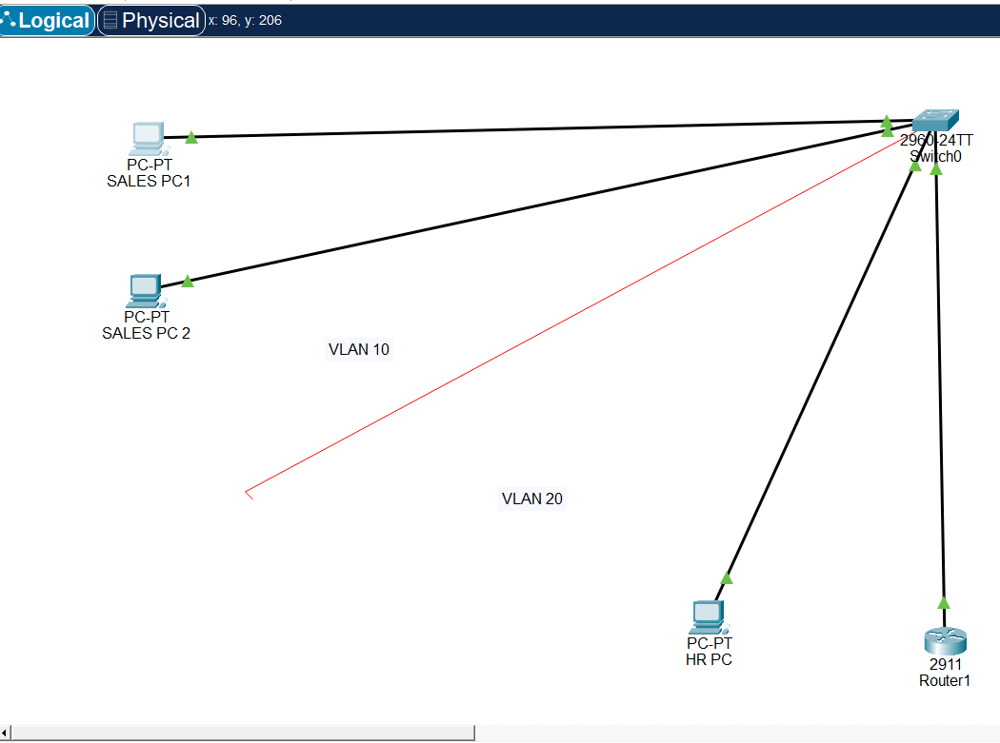
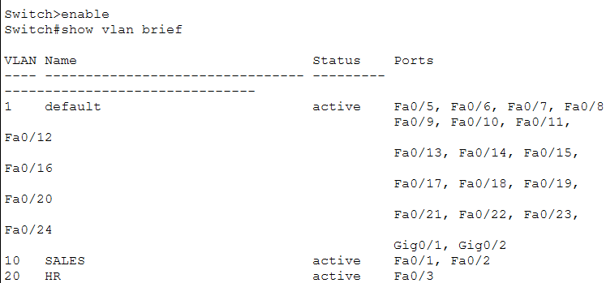
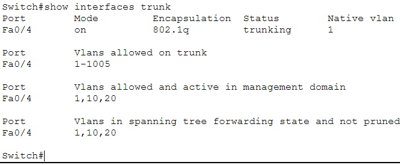
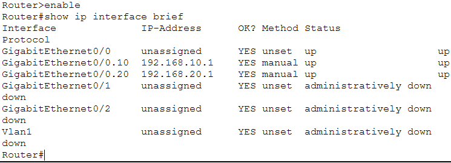
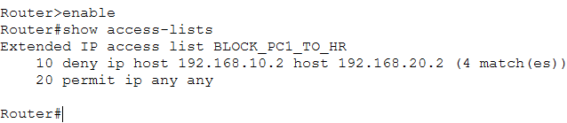
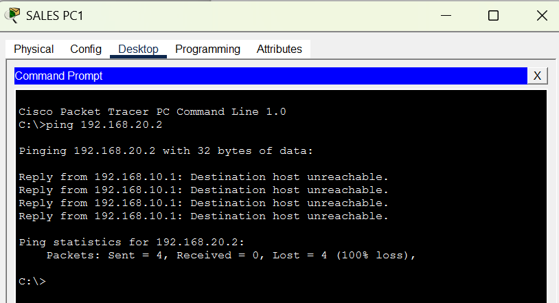
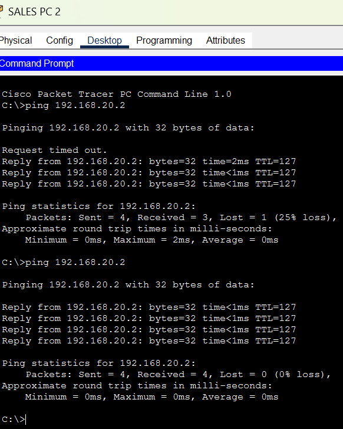
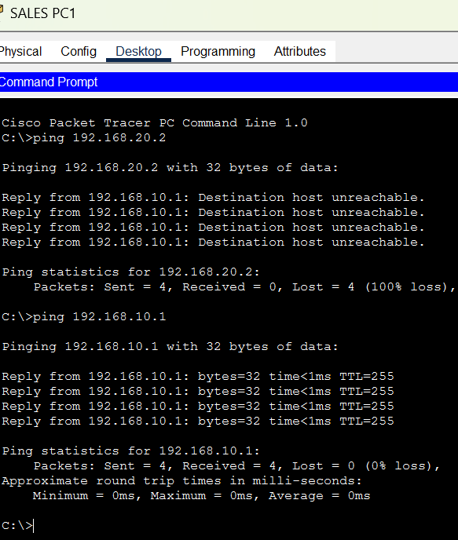

# Extended ACL Lab

## Overview

This lab builds on my previous Inter-VLAN Routing lab by implementing an **Extended Access Control List (ACL)** to control communication between hosts on different VLANs.

The objective was to block a specific Sales PC from accessing the HR PC while allowing all other network traffic to continue normally.

---

## Objectives

- Configure an Extended ACL.
- Apply the ACL inbound on the Sales VLAN interface.
- Verify that only the intended traffic is blocked.
- Confirm that all other legitimate traffic is permitted.

---

## Technologies Used

- Cisco Packet Tracer
- Cisco Catalyst 2960 Switch
- Cisco 2911 Router
- VLANs
- Router-on-a-Stick
- Extended Access Control Lists (ACLs)

---

## Network Topology


## Verification

### VLAN Configuration



### Trunk Verification



### Router Interface Verification



### ACL Verification



### Connectivity Tests

❌ **Sales PC1 → HR PC (Blocked)**



✅ **Sales PC2 → HR PC**



✅ **Sales PC1 → Gateway**



---

## IP Addressing

| Device | IP Address | VLAN |
|---------|------------|------|
| Sales PC1 | 192.168.10.2 | VLAN 10 |
| Sales PC2 | 192.168.10.3 | VLAN 10 |
| HR PC | 192.168.20.2 | VLAN 20 |
| Router G0/0.10 | 192.168.10.1 | Gateway |
| Router G0/0.20 | 192.168.20.1 | Gateway |

---

## ACL Configuration

```text
ip access-list extended BLOCK_PC1_TO_HR
 deny ip host 192.168.10.2 host 192.168.20.2
 permit ip any any
```

Applied inbound on:

```text
interface GigabitEthernet0/0.10
 ip access-group BLOCK_PC1_TO_HR in
```

---


## Key Takeaways

This lab helped me understand how Extended ACLs can be used to enforce network security by filtering traffic based on both the source and destination IP addresses.

I also learned:
- ACLs process traffic from top to bottom.
- The first matching rule is applied.
- `permit ip any any` allows all remaining traffic that does not match previous rules.
- Applying an ACL inbound allows unwanted traffic to be stopped before it is routed.

---

## Packet Tracer File

📥 Download the lab:

[Extended-ACL-Lab.pkt](Extended-ACL-Lab.pkt)
