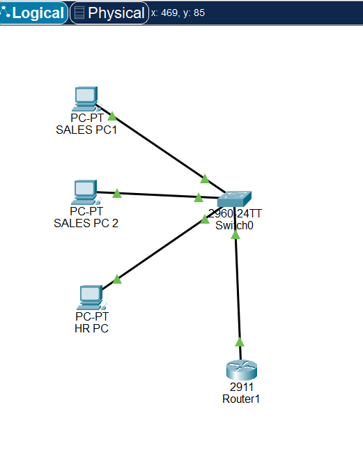

# Inter-VLAN Routing Lab (Router-on-a-Stick)

## Overview

This lab demonstrates Inter-VLAN Routing using the Router-on-a-Stick method in Cisco Packet Tracer.

The objective was to separate the Sales and HR departments into different VLANs while allowing communication between them through a router.

---

## Network Topology

---

## VLAN Configuration

### VLAN 10 - Sales
- Fa0/1
- Fa0/2

### VLAN 20 - HR
- Fa0/3

### Verification

---

## Trunk Configuration

The connection between the switch and router was configured as an IEEE 802.1Q trunk.

### Verification

---

## Router Subinterfaces

| Interface | Gateway |
|------------|----------|
| G0/0.10 | 192.168.10.1 |
| G0/0.20 | 192.168.20.1 |

### Verification

---

## IP Addressing

| Device | IP Address |
|----------|------------|
| Sales PC 1 | 192.168.10.2 |
| Sales PC 2 | 192.168.10.3 |
| HR PC | 192.168.20.2 |
| VLAN 10 Gateway | 192.168.10.1 |
| VLAN 20 Gateway | 192.168.20.1 |

---

## Connectivity Testing

Successful end-to-end ping testing verified communication between VLANs.

---

## Key Concepts Learned

- VLAN Segmentation
- Access Ports
- Trunk Ports
- IEEE 802.1Q Tagging
- Router-on-a-Stick
- Inter-VLAN Routing
- Default Gateways
- Layer 2 Switching
- Layer 3 Routing

---

## Files Included

- Inter-VLAN routing LAB.pkt
- Topology Screenshot
- VLAN Verification
- Trunk Verification
- Router Verification
- Connectivity Testing
