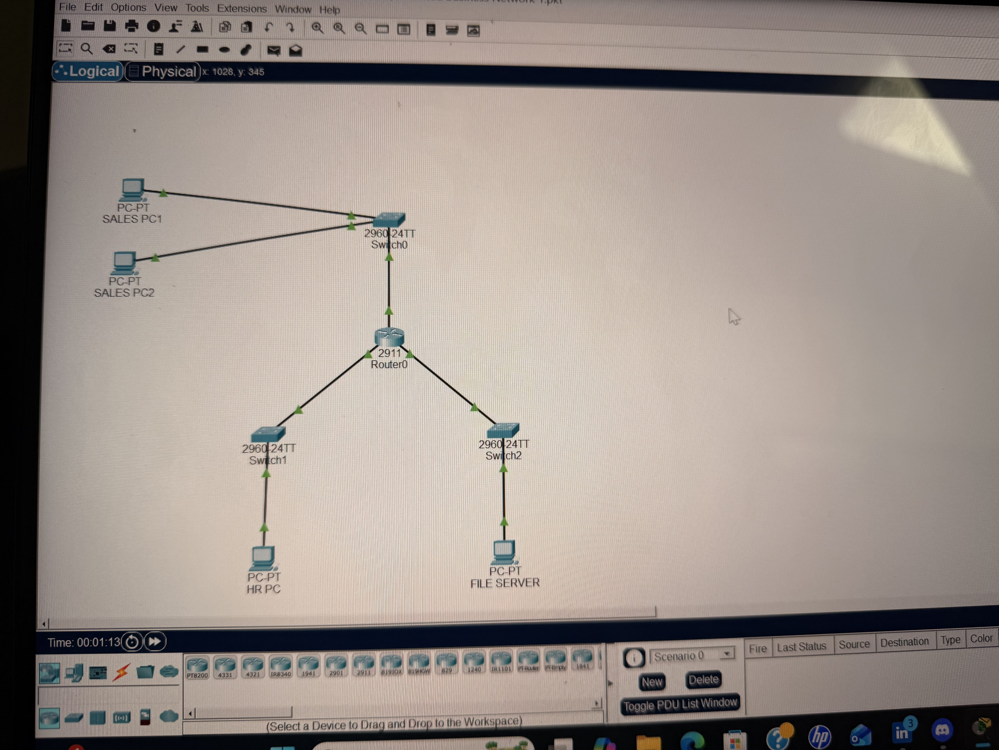

# Simulated small Business Network

## Objective

Design and configure a simulated small business network using Cisco Packet Tracer. Configure router interfaces, assign static IP addresses to end devices, implement separate subnets for different departments and verify end-to-end connectivity through successful ping testing.
## Topology

## Network Diagram

The network consists of:

- Sales Department (2 PCs)
- HR Department (1 PC)
- File Server Network
- Cisco 2911 Router
- Three Cisco 2960 Switches

A topology screenshot is included below.

## IP Addressing

### Sales Network
- Network: 192.168.10.0/24
- Gateway: 192.168.10.1

### HR Network
- Network: 192.168.20.0/24
- Gateway: 192.168.20.1

### File Server Network
- Network: 192.168.30.0/24
- Gateway: 192.168.30.1
## Screenshots

### Network Topology

### Router Configuration

### Connectivity Test

### IP Configuration

## Router Interfaces

| Interface | IP Address |
|------------|------------|
| G0/0 | 192.168.10.1 |
| G0/1 | 192.168.20.1 |
| G0/2 | 192.168.30.1 |

## Testing

Successful Connectivity Tests

- Sales PC (192.168.10.10) → HR PC (192.168.20.10)
- Sales PC (192.168.10.10) → File Server (192.168.30.10)
- HR PC (192.168.20.10) → File Server (192.168.30.10)

Result: Inter-VLAN/inter-subnet communication was successfully verified through the router.

All devices communicated successfully across different subnets.

## Skills Demonstrated

- Cisco Packet Tracer
- Router Configuration
- Static IP Addressing
- Subnetting Fundamentals
- Default Gateway Configuration
- Network Troubleshooting
- Connectivity Verification (Ping)
- Cisco IOS CLI
